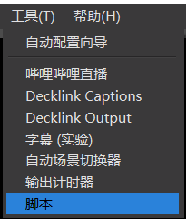
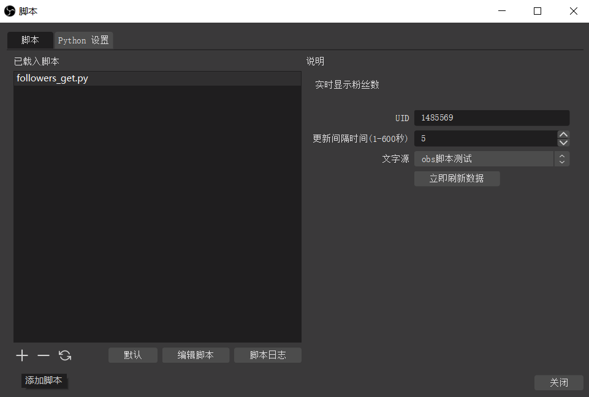

# obs_script_followers
 obs插件，实时显示b站粉丝数

## 使用方法

1. 安装[python3.6](https://www.python.org/downloads/release/python-368/) （obs暂不支持更高版本）

   *请自行百度python安装教程*

2. 打开cmd，pip安装requests库

   ```cmd
   pip install requests -i https://pypi.tuna.tsinghua.edu.cn/simple
   ```

   

3. 打开obs，工具栏点击“脚本”

   

3. “python设置”中选择第一步中python的安装路径

4. 下载本仓库中的 [followers_get.py](followers_get.py) 文件

5. 点击左下角添加脚本，选择上述下载文件

6. 选择文字源，填写UID和更新间隔时间。

7. 完成

